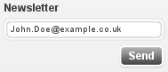
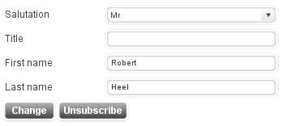
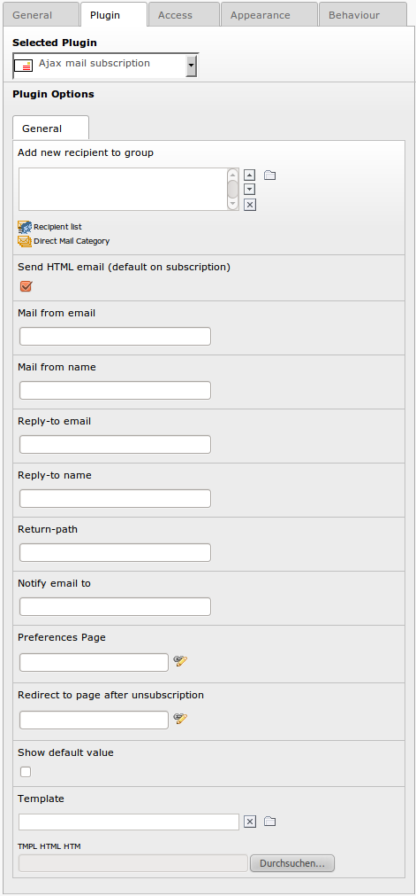

=============================
 EXT: Ajax mail subscription
=============================
:Extension Key: ods_ajaxmailsubscription
:Description: Adds a plugin for subscription to direct mail newsletters.
:Author: Robert Heel <typo3@bobosch.de>
:Copyright: 2008-2016

Introduction
============

What does it do?
----------------
- Adds a plugin for subscription to direct mail newsletters.
- Uses ajax to prevent page reloads.
- Template based design.
- Change personal newsletter preferences (name).

Screenshots
-----------
- Frontend plugin

- Frontend plugin, user can change preferences

Users manual
============

Insert the Ajax mail subscription as frontend plugin.
- To add automatically new addresses to a mailing list, select the according list in the field “Add new recipient to group”.
- Links appearing in emails sent by this extension (e.g. "To confirm the subscription, please click here") refer to the page selected in the field “Preferences Page”. Note: The selected page has to contain this extension as well.

+-------------------------------------------+---------------------------------+
|               Plugin option               |            TS option            |
+===========================================+=================================+
| Add new recipient to group                | default_group                   |
+-------------------------------------------+---------------------------------+
| Send HTML email (default on subscription) | default_type                    |
+-------------------------------------------+---------------------------------+
| Mail from email                           | mail_from                       |
+-------------------------------------------+---------------------------------+
| Mail from name                            | mail_from_name                  |
+-------------------------------------------+---------------------------------+
| Notify email to                           | mail_notify                     |
+-------------------------------------------+---------------------------------+
| Reply-to email                            | mail_reply                      |
+-------------------------------------------+---------------------------------+
| Reply-to name                             | mail_reply_name                 |
+-------------------------------------------+---------------------------------+
| Return-path                               | mail_return                     |
+-------------------------------------------+---------------------------------+
| Preferences Page                          | page_edit                       |
+-------------------------------------------+---------------------------------+
| Show default value                        | show_default                    |
+-------------------------------------------+---------------------------------+
| Template                                  | Template                        |
+-------------------------------------------+---------------------------------+
| Successful subscription mail: Subject     | mail_subscribe_subject          |
+-------------------------------------------+---------------------------------+
| Successful subscription mail: Body        | mail_subscribe_body             |
+-------------------------------------------+---------------------------------+
| Successful unsubscription mail: Subject   | mail_unsubscribe_subject        |
+-------------------------------------------+---------------------------------+
| Successful unsubscription mail: Body      | mail_unsubscribe_body           |
+-------------------------------------------+---------------------------------+
| Startingpoint                             | page_records                    |
+-------------------------------------------+---------------------------------+
| Recursive                                 | page_records_recursive          |
+-------------------------------------------+---------------------------------+

Please see configuration section for description of the fields.

Administration
==============

- In order to add an unsubscribe link to the mail, add the following link to your newsletter template:

::

	<a href="http://[your domain name]/index.php?id=[id to page of this plugin]&u=###USER_uid###&t=###SYS_TABLE_NAME###&a=###SYS_AUTHCODE###">unsubscribe</a>

- If the unscubscription should be done immediately, set authcode_std = del in TS and use this link:

::

	<a href="http://[your domain name]/index.php?id=[id to page of this plugin]&u=###USER_uid###&t=###SYS_TABLE_NAME###&a=###SYS_AUTHCODE###&do=del">unsubscribe</a>

- Unsubscribe user
  - A tt_address record won't be deleted, instead it will set to hidden (“hidden=1”). This user won't receive mails any more. If you import mail addresses using the direct_mail CSV import, the user remains unsubscribed if “Update existing user, instead renaming the new user” is set.

Template marker
---------------

Template file: ods_ajaxmailsubscription_mail.html 

+-------------------+------------------------+--------------------------------+
| Subpart           | Marker                 | Description                    |
+===================+========================+================================+
| ###MAIL_NEW...    | ###LINK###             | Link to configuration page     |
| ###MAIL_CHANGE... +------------------------+--------------------------------+
|                   | ###SERVER###           | Server name                    |
+-------------------+------------------------+--------------------------------+
|                   | ###UNSUBSCRIBE_LINK### | Link to unsubscribe            |
+-------------------+------------------------+--------------------------------+

Configuration
=============

Reference
---------

.. |pru| replace:: page_redirect_unsubscribe
.. |prr| replace:: page_records_recursive
.. |aet| replace:: authcode_expiration_time
.. |mco| replace:: mail_confirmation

.. |t3ad| replace:: typo3@###DOMAIN###
.. |tsid| replace:: $TSFE->id
.. |pstm| replace:: EXT:ods_ajaxmailsubscription/pi1/ajaxmailsubscription.tmpl
.. |allf| replace:: gender,first_name,middle_name,last_name,birthday,title,phone,mobile,www,address,building,room,company,city,zip,region,country,fax
.. |tt_a| replace:: tt_address
.. |wpce| replace:: wrap = 
|

.. |wpci| replace:: wrap = 
|

.. |psjs| replace:: EXT:ods_ajaxmailsubscription/res/ods_ajaxmailsubscription.js
.. |psht| replace:: EXT:ods_ajaxmailsubscription/pi1/ods_ajaxmailsubscription_mail.html

+-----------------+-----------+-------------------------------------+---------+
|     Property    | Data type |             Description             | Default |
+=================+===========+=====================================+=========+
| default_group   | group list| Join to these lists or groups.      |         |
|                 |           | Typo3 database group list, e.g.     |         |
|                 |           | sys_dmail_category_1,               |         |
|                 |           | sys_dmail_group_1,                  |         |
|                 |           | fe_groups_1,                        |         |
|                 |           | sys_category_1                      |         |
+-----------------+-----------+-------------------------------------+---------+
| default_type    | boolean   | HTML newsletter.                    | 1       |
|                 |           | Value of module_sys_dmail_html.     |         |
+-----------------+-----------+-------------------------------------+---------+
| mail_from       | string    | From: Sender email address in       | |t3ad|  |
|                 |           | system mails.                       |         |
+-----------------+-----------+-------------------------------------+---------+
| mail_from_name  | string    | From: Sender name in system mails.  |         |
+-----------------+-----------+-------------------------------------+---------+
| mail_notify     | string    | Notify (un)subscriptions to this    |         |
|                 |           | address                             |         |
+-----------------+-----------+-------------------------------------+---------+
| mail_reply      | string    | Reply-to: Reply email address.      |         |
+-----------------+-----------+-------------------------------------+---------+
| mail_reply_name | string    | Reply-to: Reply name.               |         |
+-----------------+-----------+-------------------------------------+---------+
| mail_return     | string    | Return-path: Bounce email address.  |         |
+-----------------+-----------+-------------------------------------+---------+
| page_edit       | integer   | Link to this page in system mails.  | |tsid|  |
+-----------------+-----------+-------------------------------------+---------+
| |pru|           | integer   | Redirect to this page after         |         |
|                 |           | unsubscription.                     |         |
+-----------------+-----------+-------------------------------------+---------+
| show_default    | boolean   | Show default “John.Doe@example.com”.| 0       |
+-----------------+-----------+-------------------------------------+---------+
| template        | string    | Template file.                      | |pstm|  |
+-----------------+-----------+-------------------------------------+---------+
| page_records    | integer   | Record storage page id              |         |
|                 | list      | (Startingpoint)                     |         |
+-----------------+-----------+-------------------------------------+---------+
| |prr|           | integer   | Recursive level                     | 0       |
+-----------------+-----------+-------------------------------------+---------+
| edit.fields     | string    | Fields used in the preference (edit)| |allf|  | 
|                 | list      | template.                           |         |
+-----------------+-----------+-------------------------------------+---------+
| subscribe.fields| string    | Fields used in the subscribe        | email   |
|                 | list      | template.                           |         |
+-----------------+-----------+-------------------------------------+---------+
| required.fields | string    | Fields required in the subscribe    | email   |
|                 | list      | template.                           |         |
+-----------------+-----------+-------------------------------------+---------+
| authcode_fields | string    | Fields used to generate authcode.   | uid     |
+-----------------+-----------+-------------------------------------+---------+
| authcode_std    | string    | Standard authcode does not expire   |         |
|                 |           | for specific actions: del           |         |
+-----------------+-----------+-------------------------------------+---------+
| |aet|           | integer   | Expiration time of authorized links | 60      |
|                 |           | in email. 0 disables expiration.    |         |
+-----------------+-----------+-------------------------------------+---------+
| default_table   | string    | Add new users as fe_users or        | |tt_a|  |
|                 |           | tt_address records.                 |         |
+-----------------+-----------+-------------------------------------+---------+
| |mco|           | boolean   |                                     | 0       |
+-----------------+-----------+-------------------------------------+---------+
| mail_html       | boolean   |                                     | 0       |
+-----------------+-----------+-------------------------------------+---------+
| error.stdWrap   | string    |                                     | |wpce|  |
+-----------------+-----------+-------------------------------------+---------+
| info.stdWrap    | string    |                                     | |wpci|  |
+-----------------+-----------+-------------------------------------+---------+
| javascript      | string    |                                     | |psjs|  |
+-----------------+-----------+-------------------------------------+---------+
| mailtemplate    | string    |                                     | |psht|  |
+-----------------+-----------+-------------------------------------+---------+

Example
.......

::

	plugin.tx_odsajaxmailsubscription_pi1 {
		default_group = sys_dmail_group_2
		mail_from = newsletter@your-domain.com
	}
